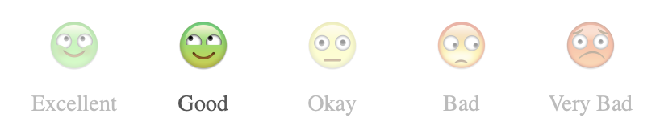

# react-ratings-emoji

[](https://www.npmjs.com/package/react-ratings-emoji)

The Emojis component is a React component that allows users to rate something using a row of emojis. Each emoji represents a rating, and users can click on an emoji to select their rating. The component supports different sizes, reverse order display, and custom styling and labels.



Installation

To install the Emojis component, add it to your project via npm:

```
npm install react-ratings-emoji
```

Or with Yarn:

```
yarn add react-ratings-emoji
```

## Usage

First, import the Emojis component and the emoji images you want to use. Then, use the component in your JSX with the desired props.

Example

```jsx
import React from 'react';
import {Emojis} from 'react-ratings-emoji'; 

function App() {
  const labels = ['Excellent', 'Good', 'Okay', 'Bad', 'Very Bad'];

  return (
    <div>
      <h1>Rate Your Experience</h1>
      <Emojis
        labels={labels}
        size="medium"
        reverse={false}
        className="custom-style"
      />
    </div>
  );
}

export default App;
```
## Props
| Name | Type | Description | Example |
|---|---|---| --- |
|__labels__ | (Array<string>) | An array of strings representing the labels for each emoji. The number of labels should match the number of emojis. | ['Very Bad', 'Bad', 'Okay', 'Good', 'Excellent'] |
| __reverse__ | (boolean) |  If true, reverses the order of emojis and labels. Defaults to false. | reverse={true}
| __size__ | ('small', 'medium', 'large') | Determines the size of the emojis and labels. Available options are: __'small'__: Emoji width:30px and height:20px, label font size is 8px. __'medium'__: Emoji width:60px and height:40px, label font size is 14px. __'large'__: Emoji width:120px and height:80px, label font size is 20px. | Example: size="large"
| __className__ | (string) | A custom CSS class to apply additional styles to the component. This class can be used to override default styles and apply custom colors, margins, etc. | Example: className="custom-style"


## CSS Variables

The Emojis component uses CSS variables for dynamic styling. You can override these variables using the className prop to change the label color and other styles.

```css
.custom-style {
  --emoji-label-color: #ff5722; 
}
```

## Custom Styling Example

```jsx
import React from 'react';
import {Emojis} from 'react-ratings-emmoji'; 

function App() {
  const labels = ['Excellent', 'Good', 'Okay', 'Bad', 'Very Bad'];

  return (
    <div>
      <style>
        {`
          .custom-style {
            --emoji-label-color: #ff5722; 
          }
        `}
      </style>
      <Emojis
        labels={labels}
        size="medium"
        reverse={false}
        className="custom-style"
      />
    </div>
  );
}

export default App;
```

## Contributing

Contributions are welcome! Please fork the repository and submit a pull request with your changes. Make sure to follow the coding standards and include tests for your changes.
